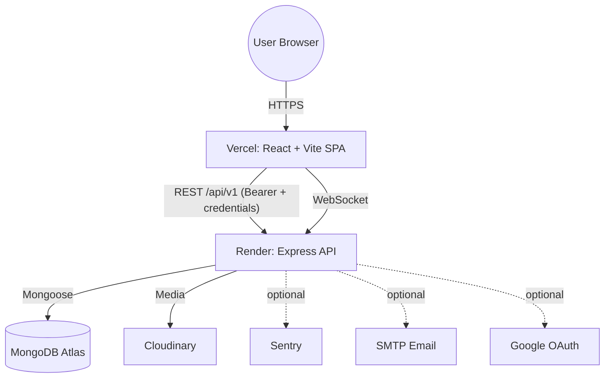
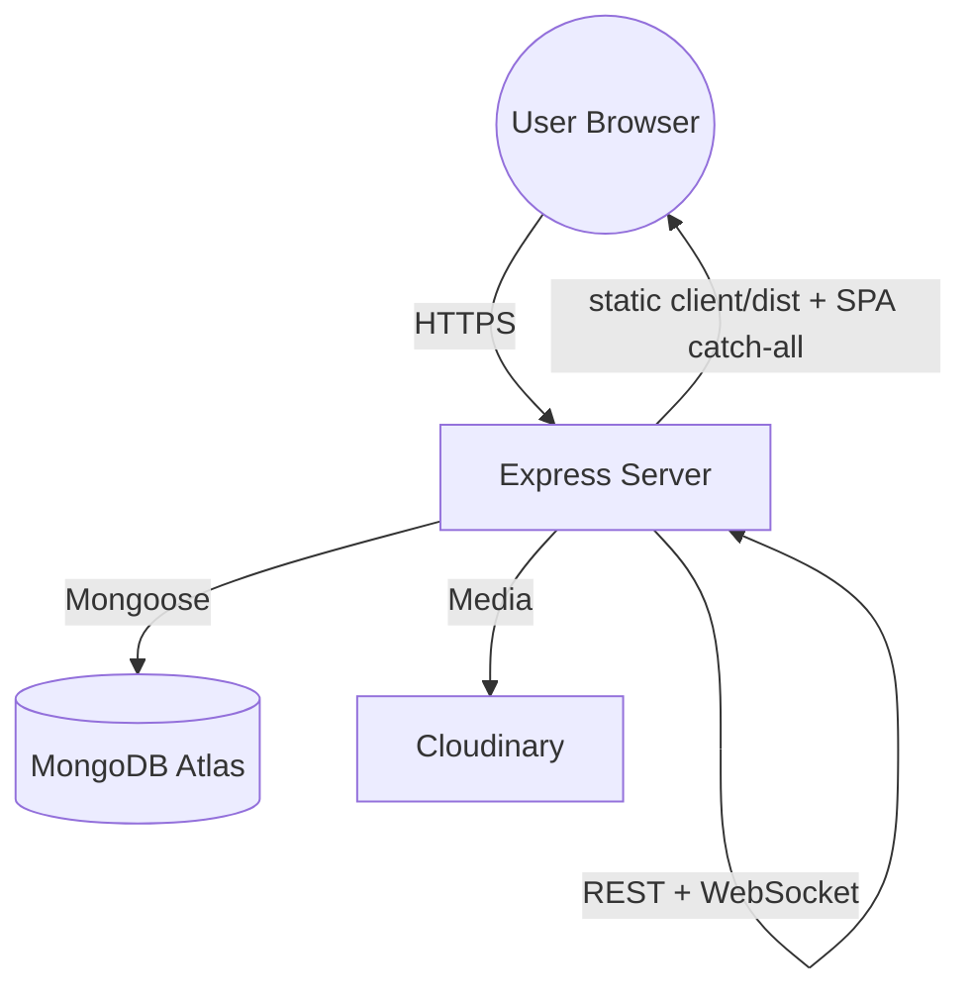

# 🎥 VTube — A Production-Grade Video Streaming Platform

[](https://vtube-t8ps.onrender.com/)
[](https://nodejs.org/)
[](https://www.mongodb.com/)
[](https://react.dev/)
[](#-testing)
[](https://opensource.org/licenses/ISC)


**VTube** is a full-stack, YouTube-inspired video streaming application built on the **MERN** stack. It pairs a fast React + Vite client with a hardened Node/Express + MongoDB API that covers the full creator/viewer lifecycle: uploads, streaming, comments with replies, likes, subscriptions, playlists, watch history & resume, real-time notifications, a creator dashboard, content reporting/moderation, and optional Google sign-in and transactional email.

The codebase was built and hardened across four delivery phases (stabilization → quality hardening → viewer features → social & discovery) with **property-based and integration tests** and a security pass aimed at production deployment.

---

## 📑 Table of Contents

- [Features](#-features)
- [Architecture](#-architecture)
- [Tech Stack](#-tech-stack)
- [Project Structure](#-project-structure)
- [Data Models](#-data-models)
- [Security & Hardening](#-security--hardening)
- [Getting Started](#-getting-started)
- [Environment Variables](#-environment-variables)
- [Available Scripts](#-available-scripts)
- [Testing](#-testing)
- [API Reference](#-api-reference)
- [Real-Time Notifications](#-real-time-notifications)
- [Deployment](#-deployment)
- [Troubleshooting](#-troubleshooting)
- [Contributing](#-contributing)
- [License](#-license)

---

## 🚀 Features

### 🔐 Authentication & Accounts
- **JWT auth with refresh-token rotation** — short-lived access tokens plus rotating refresh tokens. Each refresh issues a new pair and invalidates the previous refresh token (reuse/post-logout tokens are rejected).
- **Hybrid token transport** — the access token is sent as a `Bearer` header (works seamlessly cross-origin); the refresh token lives in a hardened `HttpOnly` cookie.
- **Per-account brute-force lockout** — repeated failed logins lock an account for a configurable window; non-existent accounts are treated identically to avoid user enumeration.
- **Optional Google Sign-In** — `POST /auth/google` verifies a Google ID token and mints a VTube session (mounted only when Google credentials are configured).
- **Optional email flows** — account-verification and password-reset request endpoints (mounted only when SMTP is configured); tokens are single-use with a ≤ 60-minute TTL.
- **Profile management** — update avatar, cover image, full name/email, and change password.

### 📹 Videos
- **Uploads** via Multer → Cloudinary with a hardened upload pipeline (type allowlist, size caps, randomized filenames).
- **Streaming** endpoint with HTTP range support.
- **Discovery** — list with filtering, sorting, and pagination; keyword **search** plus **autocomplete suggestions**.
- **View counting** and **publish/unpublish** toggling.
- **Ownership enforcement** — only the owner can update, delete, or toggle a video.

### 💬 Comments
- Threaded **comments and replies** on videos.
- **Pin / unpin** comments (video owner only).
- Like comments; fetch a user's liked comments.

### 👍 Engagement & Social
- **Likes** for videos, comments, and tweets, with "liked" listing endpoints.
- **Subscriptions** — subscribe/unsubscribe, list subscribers, list subscribed channels, and a **subscription feed** of videos from followed channels.
- **Tweets** — short text posts with full CRUD.

### 📂 Organization & Playback
- **Playlists** — create/update/delete, add/remove videos, ownership-checked.
- **Watch History** — automatically tracked; clear all or remove a single entry.
- **Watch Later** — add/remove/list.
- **Watch Progress** — save and resume playback position per video.

### 📊 Creator Tools
- **Dashboard** — channel stats (total views, subscribers, likes, video count) and the channel's video list (stats response cached for performance).

### 🔔 Real-Time
- **Notifications** over **Socket.IO** — authenticated socket delivers new-activity events and unread-count signals in real time; REST endpoints list, mark-as-read, and clear.

### 🛡️ Trust & Safety
- **Content reporting** — any authenticated user can file a report.
- **Moderation** — moderator-only endpoints to list, resolve (hide target), or dismiss reports.

---

## 🏛️ Architecture

VTube ships in **two supported topologies**. The same server codebase supports both — it serves the built SPA when `client/dist` is present, and runs as a pure JSON API when it isn't.

### Split deployment (recommended for this project)

Frontend on **Vercel**, backend API on **Render**. Different origins, so CORS + cross-site cookies are configured explicitly.



### Combined deployment (single service)

The Express server also serves the compiled React build from `client/dist` and falls back to `index.html` for client-side routes — one origin, simplest cookie story.



### Request lifecycle (API)

```
Request
  → Helmet (secure headers, env-driven CSP/CORP)
  → Structured request logging (pino-http)
  → Rate limiting (global → auth/upload tiers)
  → CORS (env-driven allowlist + credentials)
  → Body / cookie parsers
  → Route: verifyJWT/optionalJWT → validate(schema) → [multer] → verifyOwnership → controller
  → Global error handler → uniform JSON { statusCode, success, message, errors }
```

---

## 🛠️ Tech Stack

### Backend
| Concern | Technology |
| :--- | :--- |
| Runtime / framework | Node.js (ES Modules) · Express 4 |
| Database | MongoDB · Mongoose 8 · `mongoose-aggregate-paginate-v2` |
| Media | Cloudinary · Multer (`multipart/form-data`) |
| Auth & crypto | `jsonwebtoken` · `bcrypt` · `google-auth-library` |
| Real-time | Socket.IO |
| Security | Helmet · `express-rate-limit` · custom account-lockout |
| Logging / monitoring | `pino` / `pino-http` (secret redaction) · `@sentry/node` (optional) |
| Email | `nodemailer` (optional) |
| Caching | `node-cache` |
| Testing | Vitest · `fast-check` (property-based) · Supertest |

### Frontend
| Concern | Technology |
| :--- | :--- |
| UI | React 19 · React Router 7 |
| Build | Vite |
| HTTP | Axios (interceptors: Bearer injection + silent refresh) |
| Realtime | `socket.io-client` |
| Video | Video.js |
| State | Context API (Auth, Theme, Toast) |
| Testing | Vitest · `@testing-library/react` · `jest-axe` (a11y) · `fast-check` |

---

## 📁 Project Structure

```bash
Vtube_backend_sir/
├── client/                       # React + Vite frontend (deploy → Vercel)
│   ├── src/
│   │   ├── api/                  # axios instance + socket client
│   │   ├── components/           # reusable UI (+ components/ui primitives)
│   │   ├── context/              # Auth / Theme / Toast providers
│   │   ├── pages/                # route views (Home, Watch, Channel, ...)
│   │   └── utils/                # formatters & client helpers
│   ├── .env.example              # client env template
│   └── vercel.json               # Vercel build + SPA rewrites
│
├── server/                       # Express API (deploy → Render)
│   ├── src/
│   │   ├── config/               # env, cookies, helmet, logger, dns
│   │   ├── controllers/          # request handlers (one per domain)
│   │   ├── db/                   # MongoDB connection
│   │   ├── middlewares/          # auth, ownership, validate, rate limit,
│   │   │                         #   multer, moderation, account lockout, errors
│   │   ├── models/               # Mongoose schemas
│   │   ├── routes/               # API endpoint definitions
│   │   ├── services/             # token rotation, email, google OAuth,
│   │   │                         #   view counting, error monitoring
│   │   ├── socket/               # Socket.IO notification server
│   │   ├── utils/                # ApiError, ApiResponse, asyncHandler,
│   │   │                         #   ApiFeatures, cache, cloudinary
│   │   ├── validators/           # per-domain request schemas
│   │   ├── __tests__/            # unit / integration / property tests
│   │   ├── app.js                # Express app factory (createApp)
│   │   └── index.js              # bootstrap (db connect + http + socket)
│   └── .env.sample               # server env template
│
├── Dockerfile                    # multi-stage image (combined deploy)
├── .dockerignore
├── render.yaml                   # Render blueprint (backend)
├── .gitignore                    # ignores .kiro, .env*, dist, node_modules, ...
└── README.md
```

---

## 🗃️ Data Models

| Model | Purpose |
| :--- | :--- |
| `User` | Account, profile (avatar/cover), hashed password, refresh-token anchor, watch history |
| `Video` | Video metadata, Cloudinary URLs, owner, views, publish state |
| `Comment` | Comments + replies (self-referential), pin state |
| `Like` | Polymorphic likes for video / comment / tweet |
| `Subscription` | Subscriber ↔ channel relationship |
| `Tweet` | Short text posts by a user |
| `Playlist` | Owned collection of videos with visibility |
| `Notification` | Per-user activity notifications (read/unread) |
| `WatchLater` | Per-user saved-for-later videos |
| `WatchProgress` | Per-user, per-video playback position |
| `Report` | Content reports with moderation status |

---

## 🛡️ Security & Hardening

- **Hardened uploads** — two Multer uploaders: `upload` (image **or** video, large cap) for publishing and `uploadImage` (image-only, small cap) for avatars/covers/thumbnails. Both enforce a **MIME allowlist**, **per-file size limits**, and **server-generated random filenames** (never the client-supplied name → no path traversal/overwrite). Limit violations map to clean `400`/`413` responses.
- **Authorization** — `verifyOwnership` guards every mutating route on videos, comments, tweets, and playlists, so a signed-in user can only modify content they own. Moderator-only routes are gated by `requireModerator`.
- **Cookie hardening** — auth cookies are `HttpOnly`, `Secure` in production, and use a configurable `SameSite` policy (`strict` by default; `none` for cross-site Vercel↔Render).
- **CORS** — env-driven allowlist with credentials; in production only the configured origin is trusted (the wildcard `*` is refused with credentials), while localhost dev origins are allowed only outside production.
- **Helmet** — secure HTTP headers with env-aware CSP/CORP (Cloudinary always allowed; Vite dev origins only outside production).
- **Tiered rate limiting** — a global limiter plus stricter **auth** (login/register/refresh/change-password) and **upload** tiers; upload throttling on `/videos` is method-scoped so public GETs are never throttled.
- **Account lockout** — per-account failed-login counter with configurable threshold/window/duration; fails closed if the store is unavailable.
- **Uniform errors** — a global error handler returns `{ statusCode, success, message, errors }` and never leaks stack traces, file paths, or raw DB/third-party text in production.
- **Structured logging** — `pino` request/error logs with **secret redaction** at any depth.
- **Optional Sentry** — error monitoring is a fire-and-forget no-op unless `SENTRY_DSN` is set.
- **Secret hygiene** — all secrets live in `.env` (git-ignored); only `*.sample`/`*.example` templates are committed.

> ⚠️ **Accessibility note:** the client includes automated `jest-axe` checks, but full WCAG compliance still requires manual testing with assistive technologies and expert review.

---

## 🏁 Getting Started

### Prerequisites
- **Node.js 18+** and npm
- A **MongoDB** database (local or [MongoDB Atlas](https://www.mongodb.com/atlas))
- A **Cloudinary** account (cloud name + API key/secret)

### 1. Clone
```bash
git clone <your-repo-url>
cd Vtube_backend_sir
```

### 2. Backend
```bash
cd server
npm install
# create your .env from the template:
#   copy .env.sample .env       (Windows)
#   cp .env.sample .env         (macOS/Linux)
# fill in MONGODB_URL, token secrets, and Cloudinary keys, then:
npm run dev          # starts on http://localhost:8000 with nodemon
```

> Note: the server's `postinstall` builds the client automatically (used for combined deploys). For local development you typically run the two apps separately as shown here.

### 3. Frontend
```bash
cd client
npm install
# create your .env from the template:
#   copy .env.example .env      (Windows)
#   cp .env.example .env        (macOS/Linux)
# default points at the local API:
#   VITE_API_URL=http://localhost:8000/api/v1
npm run dev          # starts on http://localhost:5173
```

Open **http://localhost:5173**.

---

## ⚙️ Environment Variables

### Server (`server/.env`) — see `server/.env.sample`

| Variable | Required | Description |
| :--- | :---: | :--- |
| `PORT` | ✓ | Server port (e.g. `8000`). On Render this is injected automatically. |
| `NODE_ENV` | ✓ | `development` or `production`. Drives `Secure` cookies, CSP, log level. |
| `MONGODB_URL` | ✓ | MongoDB connection string. |
| `DNS_SERVERS` | — | Optional comma-separated DNS IPs (e.g. `8.8.8.8,8.8.4.4`) to work around resolvers that fail the Atlas SRV lookup. |
| `ACCESS_TOKEN_SECRET` | ✓ | Secret for signing access tokens. |
| `ACCESS_TOKEN_EXPIRY` | ✓ | Access token lifetime (e.g. `1d`). |
| `REFRESH_TOKEN_SECRET` | ✓ | Secret for signing refresh tokens. |
| `REFRESH_TOKEN_EXPIRY` | ✓ | Refresh token lifetime (e.g. `10d`). |
| `COR_ORIGIN` | ✓ | Allowed frontend origin (exact URL in prod; `*` is ignored in production). |
| `COOKIE_SAMESITE` | — | `strict` (default) \| `lax` \| `none`. Use `none` for cross-site (Vercel↔Render). |
| `CLOUDINARY_CLOUD_NAME` | ✓ | Cloudinary cloud name. |
| `CLOUDINARY_API_KEY` | ✓ | Cloudinary API key. |
| `CLOUDINARY_API_SECRET` | ✓ | Cloudinary API secret. |
| `LOG_LEVEL` | — | Log verbosity in non-prod (`debug`/`info`/...). Forced to `info`+ in prod. |
| `RATE_LIMIT_GLOBAL` / `_AUTH` / `_UPLOAD` | — | Override per-window request caps (test/staging tuning). |
| `LOCKOUT_MAX_FAILURES` / `LOCKOUT_WINDOW_MS` / `LOCKOUT_DURATION_MS` | — | Account-lockout tuning (defaults: 5 / 15 min / 15 min). |
| `EMAIL_HOST` / `EMAIL_PORT` / `EMAIL_AUTH_USER` / `EMAIL_AUTH_PASS` / `EMAIL_FROM` | — | SMTP config. **All five** required to enable email flows; otherwise disabled. |
| `SENTRY_DSN` | — | Enables Sentry error monitoring when set. |
| `GOOGLE_CLIENT_ID` / `GOOGLE_CLIENT_SECRET` | — | **Both** required to enable Google sign-in; otherwise disabled. |

### Client (`client/.env`) — see `client/.env.example`

| Variable | Required | Description |
| :--- | :---: | :--- |
| `VITE_API_URL` | ✓ | Backend API base **including** `/api/v1`. Local: `http://localhost:8000/api/v1`. Prod: `https://<render-app>.onrender.com/api/v1`. |
| `VITE_SOCKET_URL` | — | Socket.IO origin (no `/api/v1`). If omitted, derived from `VITE_API_URL`'s origin, falling back to the page origin. |

---

## 📜 Available Scripts

### Backend (`/server`)
| Script | Description |
| :--- | :--- |
| `npm run dev` | Start with `nodemon` + `dotenv` auto-reload |
| `npm start` | Start with plain `node` (production) |
| `npm run build` | No-op (no backend build step) |
| `npm run postinstall` | Builds the client (`../client`) — used by combined deploys |
| `npm test` | Run the full Vitest suite once |

### Frontend (`/client`)
| Script | Description |
| :--- | :--- |
| `npm run dev` | Start the Vite dev server |
| `npm run build` | Production build → `dist/` |
| `npm run preview` | Preview the production build locally |
| `npm run lint` | Run ESLint |
| `npm test` | Run the Vitest suite once |

---

## 🧪 Testing

The project is tested with **Vitest**, including **property-based tests** (`fast-check`), integration tests (Supertest), and accessibility checks (`jest-axe`).

```bash
# Backend  (run from /server)
npm test        # 184 tests across 64 files

# Frontend (run from /client)
npm test        # 53 tests across 16 files
```

Property-based tests encode correctness properties and exercise them across many generated inputs, complementing example-based unit and integration tests.

---

## 📡 API Reference

Base URL: `/<host>/api/v1`. Protected routes require an `Authorization: Bearer <accessToken>` header (the refresh flow additionally uses the `refreshToken` cookie). `optionalJWT` routes are public but attach the user when a token is present.

### Auth & Users — `/users`
| Method | Endpoint | Auth | Description |
| :--- | :--- | :---: | :--- |
| POST | `/register` | — | Register (multipart: `avatar` required, `coverImage` optional) |
| POST | `/login` | — | Log in; returns tokens + sets cookies |
| POST | `/logout` | ✓ | Log out; revokes refresh token, clears cookies |
| POST | `/refresh-token` | cookie | Rotate and reissue tokens |
| POST | `/change-password` | ✓ | Change current password |
| GET | `/current-user` | ✓ | Current user profile |
| PATCH | `/update-account` | ✓ | Update full name / email |
| PATCH | `/avatar` | ✓ | Update avatar (image upload) |
| PATCH | `/cover-image` | ✓ | Update cover image (image upload) |
| GET | `/c/:username` | optional | Public channel profile (+ `isSubscribed` when logged in) |
| GET | `/history` | ✓ | Watch history |
| DELETE | `/history` | ✓ | Clear watch history |
| DELETE | `/history/:video_Id` | ✓ | Remove one video from history |

### Videos — `/videos`
| Method | Endpoint | Auth | Description |
| :--- | :--- | :---: | :--- |
| GET | `/` | optional | List videos (query, sort, pagination); cached |
| GET | `/search/suggestions` | optional | Autocomplete suggestions |
| GET | `/stream/:video_Id` | — | Stream video (range requests) |
| POST | `/` | ✓ | Publish (multipart: `videoFile` + `thumbnail`) |
| GET | `/:video_Id` | optional | Get video by id |
| PATCH | `/:video_Id` | ✓ owner | Update (optional new `thumbnail`) |
| DELETE | `/:video_Id` | ✓ owner | Delete video |
| PATCH | `/toggle/publish/:video_Id` | ✓ owner | Toggle publish state |

### Comments — `/comments`
| Method | Endpoint | Auth | Description |
| :--- | :--- | :---: | :--- |
| GET | `/:video_Id` | optional | List a video's comments |
| POST | `/:video_Id` | ✓ | Add a comment/reply |
| PATCH | `/c/:comment_Id` | ✓ owner | Edit a comment |
| DELETE | `/c/:comment_Id` | ✓ owner | Delete a comment |
| GET | `/replies/:comment_Id` | optional | List replies to a comment |
| PATCH | `/c/:comment_Id/pin` | ✓ video owner | Pin a comment |
| PATCH | `/c/:comment_Id/unpin` | ✓ video owner | Unpin a comment |

### Likes — `/likes`
| Method | Endpoint | Auth | Description |
| :--- | :--- | :---: | :--- |
| POST | `/toggle/v/:videoId` | ✓ | Toggle like on a video |
| POST | `/toggle/c/:commentId` | ✓ | Toggle like on a comment |
| POST | `/toggle/t/:tweetId` | ✓ | Toggle like on a tweet |
| GET | `/videos` | ✓ | Liked videos |
| GET | `/comments` | ✓ | Liked comments |
| GET | `/tweets` | ✓ | Liked tweets |

### Subscriptions — `/subscriptions`
| Method | Endpoint | Auth | Description |
| :--- | :--- | :---: | :--- |
| POST | `/create/c/:user_Id` | ✓ | Create a channel |
| POST | `/toggle/c/:channel_Id` | ✓ | Subscribe / unsubscribe |
| GET | `/c/:channel_Id` | ✓ | List a channel's subscribers |
| GET | `/u/:subscriberId` | ✓ | List channels a user subscribes to |
| GET | `/videos` | ✓ | Subscription feed (videos from followed channels) |

### Tweets — `/tweets`
| Method | Endpoint | Auth | Description |
| :--- | :--- | :---: | :--- |
| GET | `/user/:user_Id` | — | A user's tweets (public) |
| POST | `/` | ✓ | Create a tweet |
| PATCH | `/:tweet_Id` | ✓ owner | Update a tweet |
| DELETE | `/:tweet_Id` | ✓ owner | Delete a tweet |

### Playlists — `/playlist`
| Method | Endpoint | Auth | Description |
| :--- | :--- | :---: | :--- |
| POST | `/` | ✓ | Create a playlist |
| GET | `/:playlistId` | ✓ | Get a playlist |
| PATCH | `/:playlistId` | ✓ owner | Update a playlist |
| DELETE | `/:playlistId` | ✓ owner | Delete a playlist |
| PATCH | `/add/:videoId/:playlistId` | ✓ owner | Add a video |
| PATCH | `/remove/:videoId/:playlistId` | ✓ owner | Remove a video |
| GET | `/user/:userId` | ✓ | A user's playlists |

### Dashboard — `/dashboard`
| Method | Endpoint | Auth | Description |
| :--- | :--- | :---: | :--- |
| GET | `/stats` | ✓ | Channel stats (cached) |
| GET | `/videos` | ✓ | Channel's videos |

### Notifications — `/notifications`
| Method | Endpoint | Auth | Description |
| :--- | :--- | :---: | :--- |
| GET | `/` | ✓ | List notifications |
| PATCH | `/:notificationId/read` | ✓ | Mark a notification read |
| DELETE | `/clear` | ✓ | Clear notifications |

### Watch Later — `/watch-later`
| Method | Endpoint | Auth | Description |
| :--- | :--- | :---: | :--- |
| POST | `/:videoId` | ✓ | Add to Watch Later |
| DELETE | `/:videoId` | ✓ | Remove from Watch Later |
| GET | `/` | ✓ | List Watch Later |

### Watch Progress — `/watch-progress`
| Method | Endpoint | Auth | Description |
| :--- | :--- | :---: | :--- |
| PUT | `/:videoId` | ✓ | Save playback position |
| GET | `/:videoId` | ✓ | Get saved position |

### Reports & Moderation — `/reports`
| Method | Endpoint | Auth | Description |
| :--- | :--- | :---: | :--- |
| POST | `/` | ✓ | File a report |
| GET | `/` | ✓ moderator | List reports (optional `?status`) |
| PATCH | `/:reportId/resolve` | ✓ moderator | Resolve (hide target) |
| PATCH | `/:reportId/dismiss` | ✓ moderator | Dismiss |

### Health — `/healthcheck`
| Method | Endpoint | Auth | Description |
| :--- | :--- | :---: | :--- |
| GET | `/` | — | Liveness probe (used by Render health check) |

### Conditional integrations (mounted only when configured)
| Method | Endpoint | Enabled when | Description |
| :--- | :--- | :--- | :--- |
| POST | `/auth/google` | `GOOGLE_*` set | Verify Google ID token, establish session |
| POST | `/email/verify/request` | `EMAIL_*` set | Request account-verification email |
| POST | `/email/password-reset/request` | `EMAIL_*` set | Request password-reset email |

---

## 🔌 Real-Time Notifications

The server runs a **Socket.IO** notification namespace alongside Express. The client connects with the access token in the socket `auth` payload and listens for:

- `Realtime_Notification_Event` — a new notification payload.
- `notification:unread` — updated unread count.

The client resolves the socket origin from `VITE_SOCKET_URL` → `VITE_API_URL` origin → page origin, so it works in both split and combined deployments. On Render's free tier the service sleeps when idle, which drops live socket connections until the next request wakes it.

---

## 🚀 Deployment

### Option A — Split: Vercel (frontend) + Render (backend) — *recommended*

Deploy the backend first so you have its URL for the frontend, then wire CORS back to the Vercel URL.

**1. Backend → Render**
- Render Dashboard → **New → Blueprint** and select this repo (uses [`render.yaml`](render.yaml)). Or create a Web Service manually with:
  - **Root Directory:** `server`
  - **Build Command:** `npm install --ignore-scripts` (skips the client build — the client is hosted on Vercel)
  - **Start Command:** `npm start`
  - **Health Check Path:** `/api/v1/healthcheck`
- Set environment variables when prompted: `MONGODB_URL`, `CLOUDINARY_CLOUD_NAME`, `CLOUDINARY_API_KEY`, `CLOUDINARY_API_SECRET`. The blueprint auto-generates the JWT secrets and presets `NODE_ENV=production` and `COOKIE_SAMESITE=none`. Leave `COR_ORIGIN` blank for now.
- Note the service URL, e.g. `https://vtube-api.onrender.com`.

**2. Frontend → Vercel**
- Vercel → **New Project** → import this repo → set **Root Directory = `client`** (uses [`client/vercel.json`](client/vercel.json) for the Vite build + SPA rewrites).
- Add env var `VITE_API_URL = https://vtube-api.onrender.com/api/v1` (optionally `VITE_SOCKET_URL = https://vtube-api.onrender.com`). Deploy.
- Note the URL, e.g. `https://vtube.vercel.app`.

**3. Close the loop (CORS + cookies)**
- On Render, set `COR_ORIGIN = https://vtube.vercel.app` (exact, no trailing slash) and redeploy.
- `COOKIE_SAMESITE=none` + `NODE_ENV=production` (HTTPS ⇒ `Secure`) are required for the cross-site refresh-token cookie to work between Vercel and Render.

> Auth works cross-site because the access token rides in an `Authorization: Bearer` header from `localStorage`; only the refresh-token cookie is cross-site, which the production config handles.

### Option B — Combined: single service (simplest)

The Express server can serve the built SPA itself (no CORS/cross-site cookies). Deploy just the **server** on Render (or any Node host). Its `postinstall` builds the client, and the app serves `client/dist` with an SPA catch-all. Keep `COOKIE_SAMESITE=strict` and set `COR_ORIGIN` to the service's own URL.

### Option C — Docker (combined)

A multi-stage [`Dockerfile`](Dockerfile) builds the client, installs server production deps, assembles a slim runtime, and runs as a non-root user serving both the API and the SPA.

```bash
docker build -t vtube .
docker run -p 8000:8000 --env-file server/.env vtube
```

### Hosting notes / better options
- **Render free tier sleeps after ~15 min idle**, so the first request cold-starts in ~30–60s and live sockets drop until it wakes. Fine for demos.
- If cold starts bother you, **Railway** or **Fly.io** keep services warmer on their free/trial tiers.
- For the least moving parts, prefer **Option B** (single service) — no second platform and no cross-site cookie configuration.

---

## 🧯 Troubleshooting

| Symptom | Likely cause & fix |
| :--- | :--- |
| Login works but you're logged out on refresh (split deploy) | Refresh cookie blocked. Ensure `COOKIE_SAMESITE=none`, `NODE_ENV=production` (HTTPS), and `COR_ORIGIN` exactly matches the Vercel URL. |
| `CORS: Origin '...' not allowed` | `COR_ORIGIN` doesn't match the frontend origin (check protocol and trailing slash). |
| `querySrv ECONNREFUSED/ESERVFAIL` on startup | Atlas SRV lookup blocked by the resolver. Set `DNS_SERVERS=8.8.8.8,8.8.4.4`. |
| Upload fails with `400`/`413` | File type not in the allowlist, or larger than the size cap (images vs. video have different caps). |
| Cold first request on Render | Free-tier sleep — expected. Upgrade the plan or switch hosts to avoid. |
| First request after deploy is slow / socket not connecting | Server waking from sleep; retry once it's up. |

---

## 🧩 Core Utilities

- **`ApiError`** — standardized error class: `new ApiError(statusCode, message, errors?)`.
- **`ApiResponse`** — uniform success envelope: `new ApiResponse(statusCode, data, message)`.
- **`asyncHandler`** — wraps async controllers and forwards rejections to the error handler (no `try/catch` boilerplate).
- **`ApiFeatures`** — composable MongoDB query building (filter, sort, paginate).
- **`verifyOwnership` / `requireModerator`** — authorization guards.
- **`validate(schema)`** — centralized request validation (`params` / `query` / `body`) returning `400` on bad input.
- **`cacheMiddleware(ttl)`** — in-memory response caching for hot read paths.

---

## 🤝 Contributing

Contributions are welcome! Please open an issue to discuss substantial changes, keep the test suites green (`npm test` in both `server/` and `client/`), and follow the existing code style.

## 📄 License

Licensed under the **ISC License**.

Created with ❤️ by **Abhinav Shah**
