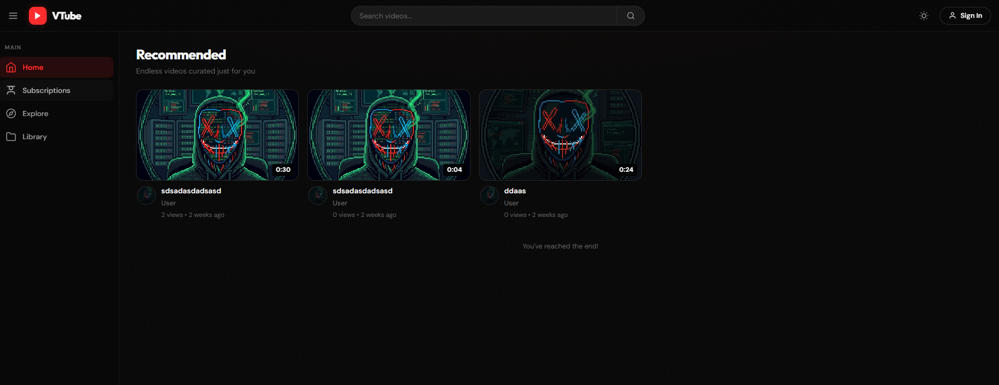
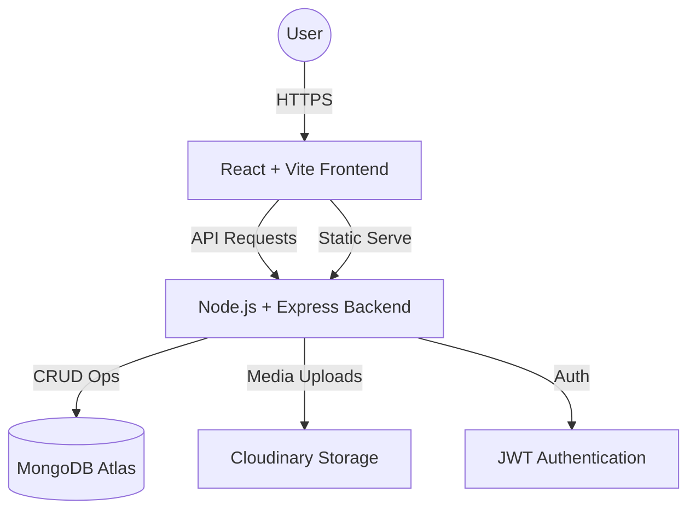

# 🎥 VTube - A Comprehensive Video Streaming Platform

[](https://vtube-t8ps.onrender.com/)
[](https://nodejs.org/)
[](https://www.mongodb.com/)
[](https://reactjs.org/)
[](https://opensource.org/licenses/ISC)



VTube is a full-stack, production-ready video streaming application inspired by YouTube. Built with the MERN stack, it offers a robust set of features ranging from video uploads and real-time interactions to sophisticated channel management and user analytics.

---

## 🏛️ System Architecture



---

## 🚀 Features

### 🔐 Authentication & Profile
- **JWT-based Security**: Secure login/register with Access and Refresh tokens.
- **Cookie-based sessions**: Persistent sessions using HTTP-only cookies.
- **Profile Management**: Update avatar, cover images, and account details.
- **Watch History**: Track and manage viewed videos.

### 📹 Video Management
- **Video Upload**: High-performance uploads powered by **Multer** and **Cloudinary**.
- **Playback**: Integrated video player with support for views and metadata.
- **Search & Filter**: Keyword-based search with pagination and sorting options.
- **Engagement**: Like/Dislike videos and leave insightful comments.

### 👥 Social & Interaction
- **Subscription System**: Follow your favorite creators and view your subscription feed.
- **Tweets**: Share short text updates with your audience.
- **Comments & Likes**: Dynamic interaction system for both videos and tweets.
- **Notifications**: Stay updated on new content and interactions.

### 📂 Organization
- **Playlists**: Create curated lists of videos, set visibility, and organize your content.
- **Dashboard**: A comprehensive creator dashboard showing total views, subscribers, likes, and video stats.

---

## 🛠️ Tech Stack

**Backend:**
- **Node.js**: Runtime environment
- **Express.js**: Web framework
- **MongoDB**: NoSQL database with **Mongoose** modeling
- **Cloudinary**: Cloud-based image and video management
- **Multer**: Middleware for handling `multipart/form-data`
- **bcrypt**: Password hashing and security

**Frontend:**
- **React.js**: Component-based UI library
- **Vite**: Ultra-fast build tool
- **React Router**: Client-side routing
- **Axios**: HTTP client for API requests
- **Video.js**: Professional-grade video player integration
- **Context API**: Global state management (Auth, Theme, Toast)

---

## 📁 Project Structure

```bash
├── client/                 # React frontend
│   ├── src/
│   │   ├── api/            # Axios configurations
│   │   ├── components/     # Reusable UI components
│   │   ├── context/        # State management (Auth, Theme)
│   │   ├── pages/          # Main application views
│   │   └── utils/          # Frontend helper functions
│   └── package.json
├── server/                 # Express backend
│   ├── src/
│   │   ├── controllers/    # Request handlers
│   │   ├── db/             # Database connection logic
│   │   ├── middlewares/    # Authentication & file upload middleware
│   │   ├── models/         # Mongoose schemas
│   │   ├── routes/         # API endpoint definitions
│   │   └── utils/          # Backend utility classes (ApiError, ApiResponse)
│   ├── .env.sample         # Template for environment variables
│   └── package.json
└── README.md
```

---

## ⚙️ Configuration & Setup

### 1. Environment Variables

Create a `.env` file in the `/server` directory and fill in the following:

| Variable | Description | Example Value |
| :--- | :--- | :--- |
| `PORT` | Port number for the server | `8000` |
| `MONGODB_URL` | MongoDB connection string | `mongodb+srv://...` |
| `ACCESS_TOKEN_SECRET` | Secret for Access Token | `your_secret_32_chars` |
| `REFRESH_TOKEN_SECRET`| Secret for Refresh Token | `your_secret_32_chars` |
| `COR_ORIGIN` | Allowed Frontend Origin | `http://localhost:5173` |
| `CLOUDINARY_CLOUD_NAME`| Cloudinary Cloud Name | `dxxxxxx` |
| `CLOUDINARY_API_KEY` | Cloudinary API Key | `123456789` |
| `CLOUDINARY_API_SECRET`| Cloudinary API Secret | `xxxxxxxx` |

### 2. Backend Setup
```bash
cd server
npm install
npm run dev
```

### 3. Frontend Setup
```bash
cd client
npm install
```
Create a `.env` in `/client`:
```env
VITE_API_URL=http://localhost:8000/api/v1
```
```bash
npm run dev
```

---

## 📜 Available Scripts

### Backend (`/server`)
| Script | Description |
| :--- | :--- |
| `npm run dev` | Starts server with `nodemon` and auto-reloading |
| `npm start` | Starts server with standard `node` |
| `npm run postinstall` | Automatically builds the client after installation |

### Frontend (`/client`)
| Script | Description |
| :--- | :--- |
| `npm run dev` | Starts Vite development server |
| `npm run build` | Builds the app for production |
| `npm run preview` | Previews the production build locally |
| `npm run lint` | Runs ESLint to check for code quality |

---

## 🚀 Deployment

The project is configured for **One-Click Deployment** to platforms like **Render** or **Heroku**:
1. The backend server is configured to serve static files from `client/dist`.
2. The `postinstall` script in the server automatically handles the frontend build process.
3. Ensure all environment variables are set in your provider's dashboard.

---

## 📡 API Endpoints (Quick Reference)

### User Routes (`/api/v1/users`)
- `POST /register`: Register a new user (handles avatar/cover image)
- `POST /login`: Login and receive tokens
- `POST /logout`: Logout user (protected)
- `POST /refresh-token`: Refresh access token
- `GET /current-user`: Get logged-in user details
- `PATCH /update-account`: Update account details
- `PATCH /avatar`: Update user avatar

### Video Routes (`/api/v1/videos`)
- `GET /`: Get all videos (with query, sort, pagination)
- `POST /`: Publish a video (protected)
- `GET /:videoId`: Get video by ID
- `PATCH /:videoId`: Update video details
- `DELETE /:videoId`: Delete video
- `PATCH /toggle/publish/:videoId`: Toggle publish status

### Social & Interaction
- **Subscriptions**: `POST /api/v1/subscriptions/toggle/c/:channelId`
- **Playlists**: `POST /api/v1/playlist/` | `GET /api/v1/playlist/user/:userId`
- **Likes**: `POST /api/v1/likes/toggle/v/:videoId`
- **Comments**: `GET /api/v1/comments/:videoId` | `POST /api/v1/comments/:videoId`
- **Tweets**: `POST /api/v1/tweets/` | `GET /api/v1/tweets/user/:userId`

---

## 🛡️ Security & Performance

- **Helmet**: Secures HTTP headers to protect against common web vulnerabilities.
- **CORS**: Configured with strict origin whitelisting and credential support.
- **Express Rate Limit**: Prevents brute-force attacks and DDoS by limiting requests per IP.
- **JWT Authentication**: Secure stateless authentication using `HttpOnly` cookies.
- **Data Sanitization**: MongoDB queries are sanitized to prevent NoSQL injection.
- **Aggregation Pipelines**: Optimized for high-performance data retrieval and real-time counts.

---

## 🧩 Core Concepts & Utilities

The backend follows a highly structured, clean-code approach using custom utilities:

- **`ApiError`**: A standardized class for consistent error reporting across all endpoints.
- **`ApiResponse`**: Ensures every successful request returns a predictable, clean JSON structure.
- **`asyncHandler`**: A wrapper to eliminate `try-catch` boilerplate in controllers.
- **`ApiFeatures`**: A generic utility for building complex MongoDB queries with filtering, sorting, and pagination.

---

## 🤝 Contribution
Contributions are welcome! Please feel free to submit a Pull Request.

## 📄 License
This project is licensed under the **ISC License**.

Created with ❤️ by **Abhinav Shah**
